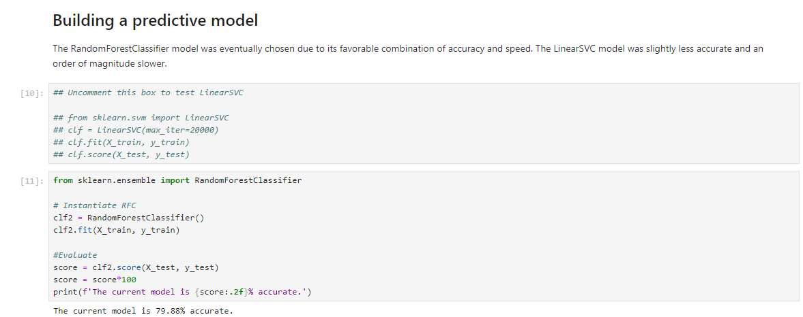
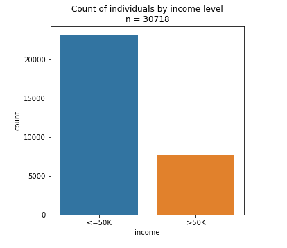
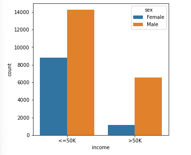
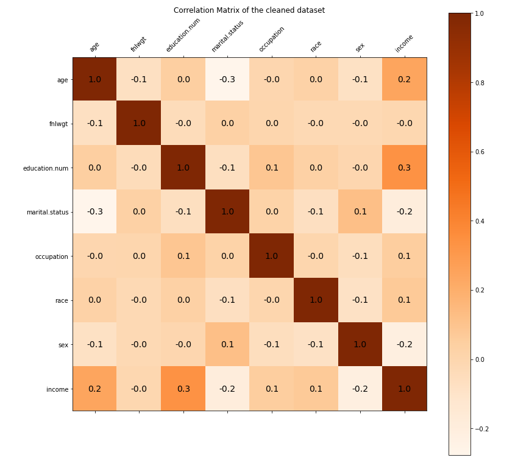
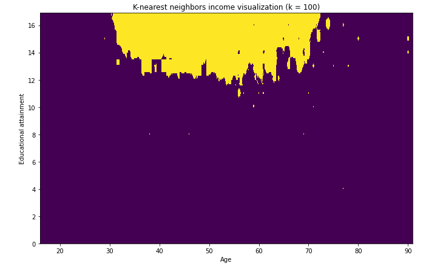
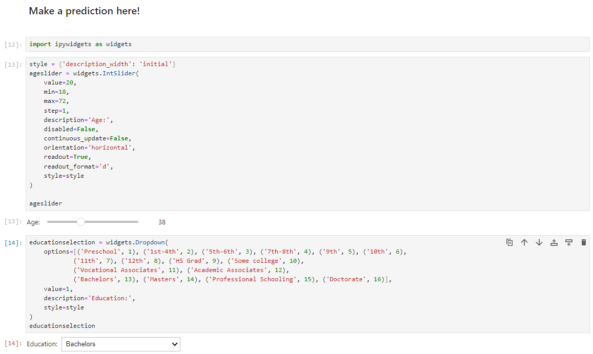
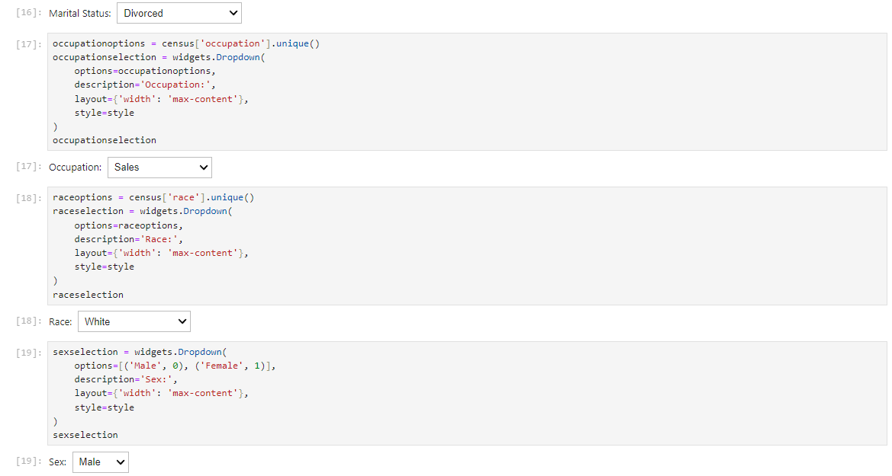
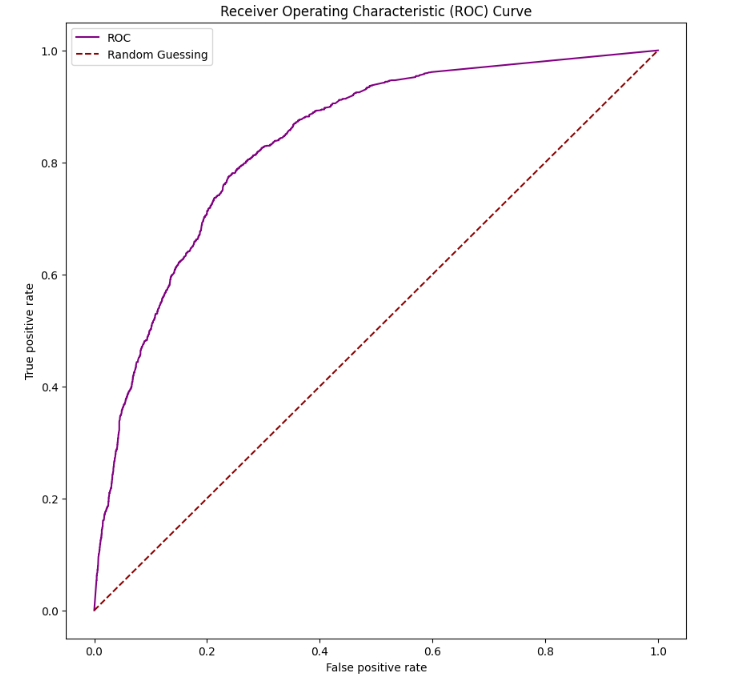
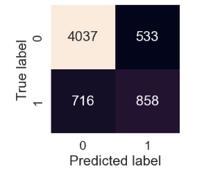

# Income Prediction Model - Capstone Project by Norbert Bull

## Project Summary

This project used machine learning tools from the Python scikit-learn library to create a predictive model for income based on factors including age, marital status, education level, and occupation type. Training data were sourced from United States Census Bureau data. The final model is able to predict whether an individual makes greater than $50,000 per year with approximately 80% accuracy. Additional visualizations were created using matplotlib and seaborn.

The app was created in a Jupyter Notebook, and originally hosted on Heroku using Voila. The app is no longer live, so screenshots of the functionality are below. Some of the visualizations will still work if you run the notebook in Github, but the meat and potatoes (the IPyWidgets for making your selections) won't work properly there.

## Data Sourcing and Cleaning

Data were sourced from U.S. Census data. Because I was a Sociology major in my "prior" life, I was familiar with simpler analysis like linear regressions using this data, and felt comfortable cleaning it up.

Short version: Unnecessary data was removed, and data was made numeric for easier analysis.

Longer version: U.S. Census data is incomplete and contains lots of missing data. Because the sample size is very large for this dataset, removing missing data doesn't reduce the size enough to affect model accuracy. After cleaning, n = 30,718.

Education was represented twice, so the categorical column was dropped in favor of the numerical one. Other weightings that the census uses were removed as well.

Income data was split into our two categories: Earners below or at $50K annually, and those above.

Other categorical columns were encoded using a LabelEncoder to make them numerical and easier for the ML model to analyze. This does have drawbacks - LabelEncoders can be more appropriate for categorical data that are comparative (e.g. good/better/best) - but is necessary to use the fields.

## Training and Testing the Model

The model uses 80% of the data for training, and the remaining 20% is used for accuracy testing. Because these splits are selected randomly each time the model is run, accuracy can vary. In all instances that I ran the model (at least dozens), accuracy was between 78% and 82%. Once trained, the model states the results of testing (patting itself on the back I suppose!)

## Data Exploration - Summary Statistics and Variable Correlation Matrix

Fewer than 1/3 of the individuals surveyed make over $50,000 per year:

    

    

The distribution by sex is also uneven, with proportionally fewer women represented in the >50K per year category. The relatively small sample size of women in the greater than >50K per year income category may make our model less accurate at classifying their incomes.

    

    

### Correlation Matrix - which variables matter?

A correlation matrix can be used as a descriptive method to visualize which features of our dataset are correlated with income, and which can be safely dropped. Income has approximately 0 correlation with the **fnlwgt** feature, so that feature is dropped in the final analysis.

**Age** and **education.num** (representing educational attainment) have a strong positive correlation with **income**, indicating that as age and educational attainment increase, income also increases.

**Sex** holds a moderate negative correlation with **income**. In our model, Male respondents are coded as a 0 and Female respondents are coded as 1. This correlation indicates that being female has a negative correlation with predicted income.

    

    

### K-nearest neighbors visualization

One interesting visualization shows how age and education work together to influence income. In the following figure, the purple region indicates an income of less than $50,000 per year, while the yellow region indicates an income of greater than $50,000 per year.

The scale on the education axis is not particularly intuitive. A value of '9' represents a high school graduate, 12 is a Bachelor's degree, and 16 is a Doctorate. This boils down to how the census data responses are structured.

The "sweet spot" in our data where individuals are most likely to make greater than $50,000 is therefore when age is between 30 and 70, and educational attainment is greater than 12 (i.e. a Bachelor's degree or higher).

    

    

## Building a predictive model

The RandomForestClassifier model was eventually chosen due to its favorable combination of accuracy and speed. The LinearSVC model was tested and found to be slightly less accurate (and an order of magnitude slower, taking several minutes to train and run).

## Making our prediction

It would be easy to feed the project a set of test using a CSV, but where is the fun in that?

I used IPyWidgets to allow the user to select from the available variables, then run the model to make a prediction using their selections. Getting this to run on Heroku was a challenge, and I was very proud of the end result. Screenshots can't bring the same satisfaction as clicking a button and getting your answer, but they will suffice here.

## Evaluating our model - Cross Validation, AUC/ROC, and the Confusion Matrix
    
Beyond simple accuracy when tested against the 20% "test" portion of data, there are other performance metrics to consider for our model.

Cross-validation asks the question: If our model were trained against different "slices" of the data, would it still perform as well? Generally, our results were around 80% - so, yes! 

Another metric is "Area under the receiver operating characteristic curve (AUC/ROC)". This mouthful basically compares our model's true positive rate vs false positive rate (TPR vs. FPR). When following the curve, the diagonal line represents random guessing. Our model's curve shows the likelihood of a false positive as different sensitivity threshholds.

For the area under the curve, a score of 1 is ideal, while random guessing would result in a score of 0.5. Our model hovers around 0.84, which is significantly better than random guessing. 

    

    

The confusion matrix compares our model's predictions against the actual outcomes based on the test set.

Ideally, the largest numbers would be in the upper left (true negative) and lower right quadrants (true positive), with smaller numbers in the upper right (false positive) and lower left (false negative) quadrants. Since the data are skewed toward lower-income earners, the model is better at identifying true negatives than true positives.

    

    

